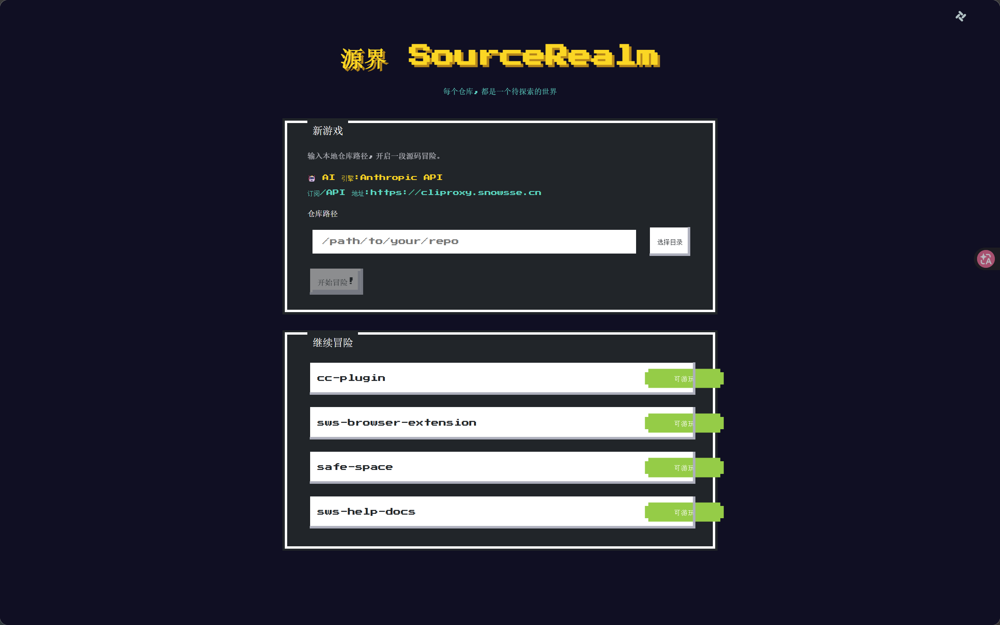
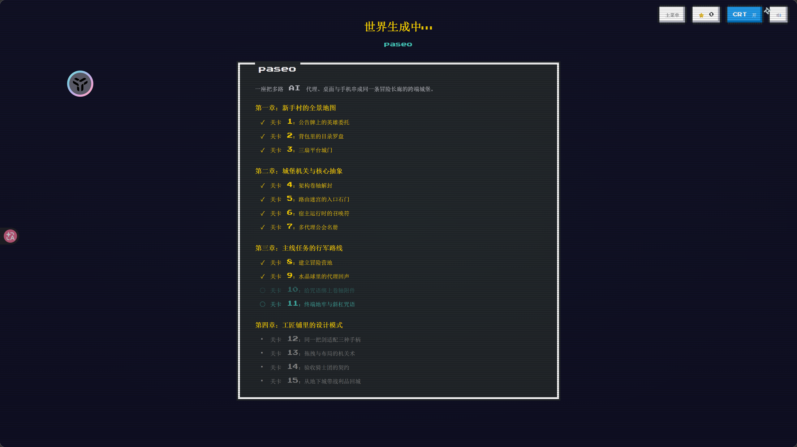
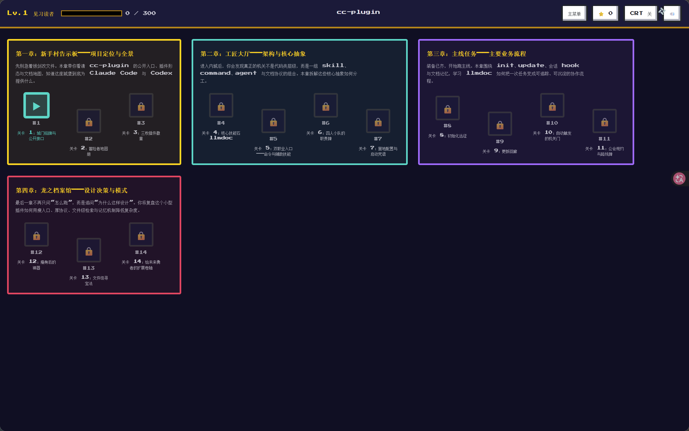
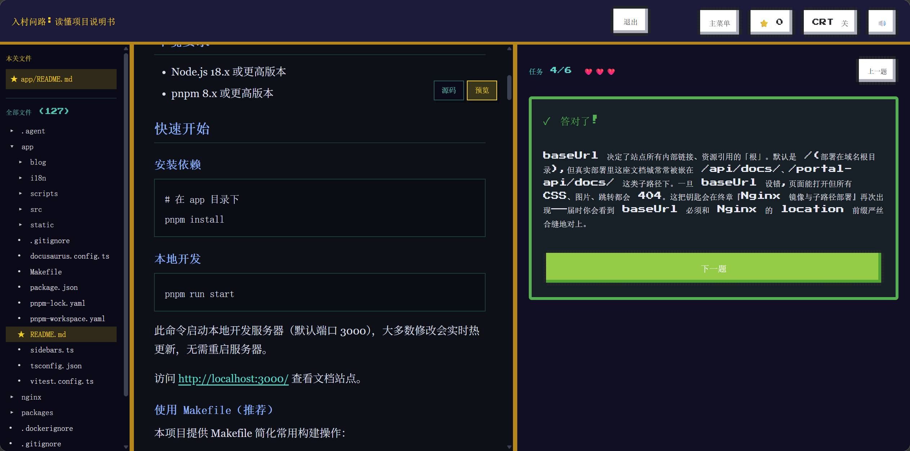

# 源界 SourceRealm

> **每个仓库，都是一个待探索的世界。**
>
> SourceRealm 是一个本地运行的像素风源码闯关阅读器：输入一个本地仓库路径，AI 会把它测绘成可游玩的源码世界，生成章节、关卡和任务；你通过答题、寻宝、调用链追踪、代码填空和打字临摹逐步读懂项目。

为什么叫「源界」？导入仓库时，界面显示「世界生成中…」；仓库有新提交时，地图会提示「世界发生了变化」。源码之「源」，世界之「界」，就是它的名字。

## 界面预览

像素风界面覆盖「导入 → 世界生成 → 闯关地图 → 进入关卡」的完整流程。

### 1. 首页 / 导入

输入本地仓库绝对路径开启「新游戏」，或从「继续冒险」列表回到已导入的项目。



### 2. 世界生成中

AI 测绘课程大纲，按章节列出关卡清单；关卡落盘后即时可玩，不必等整门课程全部完成。



### 3. 闯关地图

章节以网格卡片呈现，关卡节点显示解锁 / 锁定 / 通关状态，并记录等级与学习进度。



### 4. 关卡页

左侧是双区代码浏览器（本关文件 + 全部文件树），右侧是答题、寻宝、调用链等任务卡，顶部显示生命值与连击。



---

---

## 当前状态

SourceRealm 当前是一个本地优先的 pnpm monorepo：

- `packages/shared`：共享 zod schema、TypeScript 类型、任务判定、计分和徽章规则。
- `packages/server`：Fastify 本地 API、仓库扫描、JSON 文件存储、AI 生成、增量更新和 CLI 启动入口。
- `packages/web`：React + Vite 前端、像素风地图、关卡页、代码浏览器、任务组件和结算/徽章/证书界面。
- `llmdoc`：项目稳定知识库，给后续 AI agent 快速理解项目用。
- `docs/superpowers`：早期设计与实现计划，可能保留旧包名或旧命令，仅作历史参考。

数据默认落在启动目录下的 `.sourcerealm/`，方便直接查看和手动增删改；可用 `SOURCEREALM_HOME` 覆盖。第一版只支持本地路径导入，不做公网部署、多用户、鉴权、Git URL clone、zip 上传或移动端专项适配。

---

## 怎么玩

```text
导入本地仓库 → 世界生成中 → 闯关地图 → 进入关卡 → 完成任务 → 结算 → 徽章/证书
```

AI 会先生成课程地图，再逐关生成任务。关卡落盘后即可游玩，不需要等待整门课程全部完成。

任务类型：

- `quiz`：剧情答题，阅读指定代码片段后做单选/多选/判断。
- `treasure-hunt`：代码寻宝，在代码浏览器里点中目标行。
- `call-chain`：调用链追踪，拖拽乱序卡片排出真实执行顺序。
- `code-fill`：代码填空，补全关键代码。
- `code-type`：打字临摹，像金山打字通一样逐字输入代码。

关卡页左侧是双区代码浏览器：

- `本关文件`：来自 `level.files`，表示当前关卡最相关的推荐入口，会置顶并标星。
- `全部文件`：来自 `/api/projects/:id/tree`，展示完整仓库目录树；本关文件也会在树中以颜色/星标高亮。

两个区域共享当前选中文件。点击本关文件会自动展开全部文件树并滚动定位到对应节点；点击全部文件树中的同一文件，也会同步本关文件的 active 状态。本关文件可以跨目录、跨 package，不应按「同目录」推断相关性。

---

## 特性

- **AI 自动生成关卡**：导入本地仓库后，AI 测绘课程大纲并逐关出题。
- **本地 Claude CLI 或 API 模式**：通过 `SOURCEREALM_USE_CLI` 显式选择模式，不自动降级。
- **复古游戏体验**：NES 像素风、CRT 扫描线、心/连击/XP、S/A/B/C 评级、徽章墙和证书页。
- **实时源码引用**：关卡保存 `{ file, startLine, endLine, contentHash }`，游玩时读取当前仓库文件并检查新鲜度。
- **增量更新**：Git 仓库发生变化后，地图提示「世界发生了变化」，基于 diff 修订、作废或追加关卡，同时保留已有进度。
- **纯 JSON 存储**：不依赖数据库，项目状态、课程、关卡和进度都存为本地 JSON 文件。

---

## 快速开始

### 前置要求

- Node.js `>= 18.19.0`
- pnpm（本项目使用 pnpm workspace；不要用 npm 安装或更新依赖）
- git（增量更新依赖 git；非 git 目录仍可导入，但无法做 commit-based 增量更新）
- AI 引擎二选一：
  - Claude Code CLI：`claude` 可执行文件可用，或用 `SOURCEREALM_CLAUDE_PATH` 指定路径。
  - Anthropic API / 兼容中转：配置 `ANTHROPIC_API_KEY`，可选 `ANTHROPIC_BASE_URL`。

### 安装依赖

```bash
pnpm install
```

内部 workspace 依赖应使用 `workspace:*`，例如：

```json
"@sourcerealm/shared": "workspace:*"
```

不要把内部包写成普通 `*` 后再跑 pnpm 安装，否则 pnpm 可能尝试从 npm registry 拉取 `@sourcerealm/shared`。

### 配置 AI Provider

复制环境变量模板：

```bash
cp .env.example .env
```

服务端 CLI 会加载仓库根目录 `.env` 中的 `PORT`、`ANTHROPIC_*` 和 `SOURCEREALM_*` 变量。最少需要显式选择一种 AI 模式：

```bash
# 模式 A：使用本机 Claude Code CLI 自主探索仓库
SOURCEREALM_USE_CLI=true

# 如果服务进程找不到 claude，可额外指定绝对路径
SOURCEREALM_CLAUDE_PATH=C:\path\to\claude.exe
```

或：

```bash
# 模式 B：使用 Anthropic SDK/API 直连或中转
SOURCEREALM_USE_CLI=false
ANTHROPIC_API_KEY=sk-ant-...
ANTHROPIC_BASE_URL=https://your-relay.example.com  # 可选；留空走官方地址
SOURCEREALM_MODEL=claude-opus-4-8                  # 可选；仅 API 模式使用
```

注意：`SOURCEREALM_USE_CLI` 是第一判断源。未设置、取值非法或所选模式不可用时，服务会报错提示配置；系统不会自动从 CLI 降级到 API，也不会从 API 降级到 CLI。

常用服务端环境变量：

| 变量 | 作用 | 默认 |
|---|---|---|
| `PORT` | 本地服务端口 | `4977` |
| `SOURCEREALM_HOME` | 数据落盘目录 | 启动目录下的 `.sourcerealm/` |
| `SOURCEREALM_USE_CLI` | `true` 走 Claude CLI；`false` 走 API | 无，必须配置 |
| `SOURCEREALM_CLAUDE_PATH` | Claude CLI 可执行文件路径 | 自动探测常见位置 + PATH |
| `ANTHROPIC_BASE_URL` | API/中转地址；CLI 模式下也会注入给子进程 | Anthropic 官方地址 |
| `ANTHROPIC_API_KEY` | API key；CLI 模式下可用于强制走中转 | 无 |
| `SOURCEREALM_CONCURRENCY` | 并发生成关卡数 | `3` |
| `SOURCEREALM_MODEL` | API 模式模型名 | `claude-opus-4-8` |

### 启动

开发模式（前后端并行）：

```bash
pnpm dev
```

或分开启动：

```bash
# 终端 1：后端，默认 http://localhost:4977
pnpm --filter @sourcerealm/server dev

# 终端 2：前端 Vite，会打开浏览器
pnpm --filter @sourcerealm/web dev
```

构建前端并用后端托管静态产物：

```bash
pnpm --filter @sourcerealm/web build
pnpm --filter @sourcerealm/server dev
```

然后打开 <http://localhost:4977>，在导入向导中输入本地仓库的绝对路径。

Mock 全流程开发服务器（无需真实 LLM）：

```bash
PORT=4977 pnpm --filter @sourcerealm/server dev-mock
```

Windows PowerShell 可写成：

```powershell
$env:PORT=4977; pnpm --filter @sourcerealm/server dev-mock
```

控制台会打印 fixture 仓库路径，把它填到前端导入向导即可跑通导入、生成、游玩和增量更新流程。

---

## 前端 API / SSE 地址

前端默认请求同源 `/api`，SSE 默认订阅同源 `/api/projects/:id/events`。如果前端和后端不在同一地址，可在 Vite 启动/构建前设置：

| 环境变量 | 作用 | 默认 |
|---|---|---|
| `VITE_SOURCEREALM_API_BASE` | REST API 基地址 | 同源 `/api` |
| `VITE_SOURCEREALM_EVENTS_BASE` | SSE 订阅基地址 | 复用 `VITE_SOURCEREALM_API_BASE` |

```bash
VITE_SOURCEREALM_API_BASE=http://localhost:4977/api
VITE_SOURCEREALM_EVENTS_BASE=http://localhost:4977/api
```

这些变量由 Vite 在构建/开发启动时读取。通常应放在 `packages/web/.env`，或在 `pnpm --filter @sourcerealm/web dev` / `pnpm --filter @sourcerealm/web build` 前注入。

---

## AI Provider 细节

### Claude CLI 模式

`SOURCEREALM_USE_CLI=true` 时，服务会运行 Claude Code CLI：

```text
claude -p --input-format text --output-format json --allowedTools Read,Glob,Grep --disallowedTools Write,Edit,Bash
```

特点：

- Claude 在目标仓库目录内自主只读探索。
- 允许 `Read`、`Glob`、`Grep`，禁止写文件和执行命令。
- Prompt 通过 stdin 传入，避免 Windows 命令行参数过长。
- `SOURCEREALM_CLAUDE_PATH` 优先于自动探测路径。

### Anthropic API 模式

`SOURCEREALM_USE_CLI=false` 时，服务使用 Anthropic SDK：

- 需要 `ANTHROPIC_API_KEY`。
- 可用 `ANTHROPIC_BASE_URL` 指向中转或兼容服务。
- SDK 模式不能自主读文件，后端会把行号源码块或 diff 拼入 prompt，并用 tool-use 结构化输出约束 schema。

---

## 世界演化：增量更新

Git 项目会记录课程生成时的锚点 commit。打开地图时，前端调用 `GET /api/projects/:id/update-check` 检查当前 HEAD 是否变化。

当世界变化时：

1. 地图显示更新公告。
2. 点击更新后，后端通过 `git diff --name-status <anchor>..HEAD` 分析变更。
3. 引用被修改的关卡标记为 `stale` 并交给 LLM 最小修订。
4. 引用文件全部删除的关卡标记为 `obsolete`，地图上不可继续进入，但历史进度保留。
5. 新增文件达到阈值时追加新关卡，不重写旧课程主线。
6. 新/修订关卡先写入 `levels-next/`，全部成功后再原子切换到 `levels/`。

未受影响的关卡和 `progress.json` 不会被清空。

---

## 本地存储

每个导入项目会映射到数据根目录下的一个项目目录。默认数据根目录是启动目录下的 `.sourcerealm/`；如果配置了 `SOURCEREALM_HOME`，则使用该目录：

```text
.sourcerealm/<projectId>/
├─ project.json    # 仓库路径、名称、Git 状态、锚点 commit、生成状态
├─ course.json     # 课程大纲：章节 → 关卡概要
├─ levels/*.json   # 每关任务、题目、源码引用
├─ levels-next/    # 增量更新临时目录，成功后替换 levels/
└─ progress.json   # 通关进度、XP、徽章、已读文件
```

本地 JSON 是当前版本的数据源。没有数据库迁移流程，排查问题时可以直接查看这些文件。

---

## 架构

```text
┌────────────────────── 浏览器：React + Vite + TS ──────────────────────┐
│  Home / Generating / Map / Level / Badges / Cert                       │
│  CodeBrowser：本关文件 + 全部文件树 + Shiki 高亮 + 行点击               │
└────────────────────────────┬──────────────────────────────────────────┘
                             │ HTTP + SSE
┌────────────────────────────┴──────────────────────────────────────────┐
│                     本地 Node 服务：Fastify + TS                       │
│  RepoScanner      ProjectStore      LevelGenerator      CourseUpdater  │
│  文件树/Git/源码   JSON 读写         AI 测绘/出题        diff 增量更新    │
│  LLM providers：Claude CLI / Anthropic API / Mock                      │
└────────────────────────────┬──────────────────────────────────────────┘
                             ▼
                     .sourcerealm/<projectId>/
```

重要 API：

- `GET /api/provider`：查看当前 AI 模式和可用性。
- `POST /api/projects`：导入/复用本地仓库并按需启动生成。
- `GET /api/projects/:id/events`：生成或更新进度 SSE。
- `GET /api/projects/:id/tree`：完整仓库文件树。
- `GET /api/projects/:id/file?path=...`：读取源码文件。
- `GET /api/projects/:id/levels/:levelId`：读取关卡和引用新鲜度。
- `POST /api/projects/:id/progress/level`：提交关卡结果。
- `POST /api/projects/:id/progress/file-read`：记录已读文件。
- `GET /api/projects/:id/update-check`：检查世界是否变化。
- `POST /api/projects/:id/update`：启动增量更新。

---

## 开发与验证

常用命令：

```bash
pnpm dev                                      # 并行启动 web + server
pnpm --filter @sourcerealm/web dev            # Vite 前端
pnpm --filter @sourcerealm/web build          # 构建前端
pnpm --filter @sourcerealm/server dev         # Fastify 后端
pnpm --filter @sourcerealm/server dev-mock    # Mock 生成流程
pnpm test                                     # Vitest 全量测试
pnpm --filter @sourcerealm/server smoke       # 真实 Provider 最小冒烟
```

有后端/shared 行为变化时，优先跑相关测试：

```bash
pnpm test packages/shared/test/judge.test.ts
pnpm test packages/server/test/app.test.ts
pnpm test packages/server/test/updater.test.ts
```

有前端行为变化时，至少运行：

```bash
pnpm --filter @sourcerealm/web build
```

---

## 包名与历史命名

当前 package manifests 使用：

- `@sourcerealm/shared`
- `@sourcerealm/server`
- `@sourcerealm/web`

仓库中仍可能存在历史文档或注释提到 `code-quest` / `@code-quest/*`。修改构建、安装或包元数据时，不要只改一侧；应先确认迁移目标并保持 manifests、imports、scripts、README 和测试一致。
